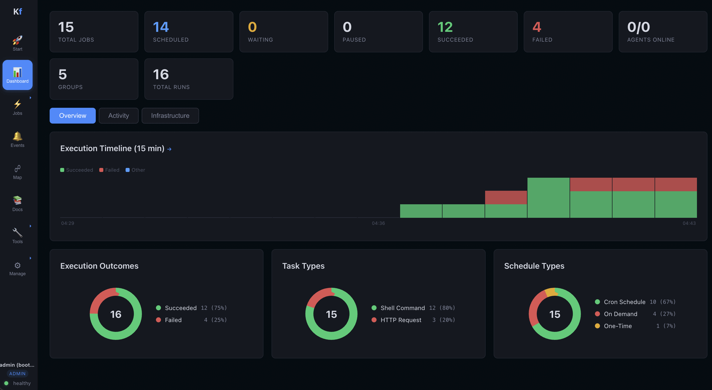

# Kronforce

[](https://github.com/mikemiles-dev/kronforce/actions/workflows/ci.yml)
[](https://github.com/mikemiles-dev/kronforce/releases)
[](LICENSE-MIT)

**Modern job scheduling and workload automation. One binary. Zero dependencies. Just run it.**

**[Try the live demo](https://demo.kronforce.dev)** | [GitHub](https://github.com/mikemiles-dev/kronforce) | [Docs](docs/)



Kronforce replaces scattered cron jobs, heavyweight platforms like Rundeck and Airflow, and stitched-together scripts with a single Rust binary that includes everything: scheduler, REST API, web dashboard, and SQLite database. No Postgres. No Redis. No Java. Download, run, automate.

## Quick Start

```bash
# Start the controller (dashboard + API + scheduler)
cargo run --bin kronforce

# Open http://localhost:8080
# Bootstrap API keys are printed to the console on first startup
```

That's it. You have a running scheduler with a web dashboard.

**Load sample data** to see it in action:

```bash
./data/test/seed.sh kf_your_admin_key
```

## Why Kronforce?

| Problem | Kronforce Solution |
|---|---|
| Cron jobs scattered across machines with no visibility | Visual dashboard with execution history, output viewer, and timeline |
| No alerts when scheduled tasks fail | Slack, Teams, PagerDuty, email, and SMS notifications out of the box |
| Airflow/Rundeck requires Postgres + Redis + Java | Single binary, zero external dependencies |
| Can't chain jobs or pass data between them | Output extraction writes values to variables, next job reads them with `{{VAR}}` |
| No way to run tasks on remote machines | Distributed agents in any language (Python, Go, Node, Rust) |
| Teams sharing one scheduler with no isolation | API keys scoped to job groups, OIDC/SSO with role mapping |

## Core Features

### Scheduling & Execution

- **16 task types** — Shell, HTTP, SQL, FTP/SFTP, Rhai scripting, MCP (AI tools), file push, Kafka (publish + consume), RabbitMQ (publish + consume), MQTT (publish + subscribe), Redis (publish + read), and custom agent-defined types
- **Flexible scheduling** — cron (second precision with visual builder), calendar expressions (last day of month, nth weekday, offsets), one-shot, on-demand, and event-driven
- **Priority scheduling** — higher priority jobs fire first when multiple are due
- **Job templates** — save any job as a reusable template, create new jobs from the template library
- **Execution retry** — automatic retry on failure/timeout with configurable backoff
- **Concurrency controls** — limit max concurrent runs per job to prevent overlapping cron executions
- **Parameterized runs** — define parameter schemas on jobs, pass runtime values at trigger time with `{{params.NAME}}` substitution
- **Webhook triggers** — unique token URLs per job for external integrations (CI/CD, GitHub, Stripe) — no API key needed
- **Live output streaming** — SSE endpoint streams stdout/stderr in real-time during execution with auto-scrolling in the UI
- **Approval workflows** — require sign-off before critical jobs run
- **Dependency chains** — jobs wait for upstream jobs to succeed, with optional time windows; force-trigger blocked jobs with "Run Anyway"
- **SLA deadlines** — set completion deadlines with early warning alerts
- **Job version history** — full snapshot on every change for audit trail

### Output Intelligence

- **Extract values** from stdout using regex or JSONPath
- **Write to variables** — extracted values auto-update global variables for downstream jobs
- **Pattern triggers** — fire events when output matches specific patterns
- **Output assertions** — fail jobs when expected output is missing
- **Diff across runs** — compare output between consecutive executions

### Distributed Agents

- **Standard agents** (Rust) — push-based, runs all built-in task types
- **Custom agents** (any language) — pull-based, define task types in the UI, handle them in Python/Go/Node
- **gRPC agent** — example agent bridging to gRPC services via grpcurl
- **MCP agent** — example agent bridging to AI tool servers
- **Tag-based targeting** — route jobs to agents by tags, or run on all agents simultaneously

### Notifications

- **Slack** — incoming webhook with formatted messages
- **Microsoft Teams** — webhook with title/body cards
- **PagerDuty** — Events API v2 integration
- **Email** — SMTP with TLS
- **SMS** — Twilio or any webhook-based SMS provider
- **Per-job controls** — notify on failure, success, or assertion failure with recipient overrides

### Security & Enterprise

- **API key authentication** — 4 roles (admin, operator, viewer, agent) with group-scoped access
- **OIDC/SSO** — Okta, Azure AD, Google, Keycloak with configurable role mapping from IdP claims
- **Audit logging** — append-only trail for all state-changing operations
- **Secret variables** — masked in API and UI, substituted at runtime
- **Rate limiting** — 3-tier (public, authenticated, agent) with configurable limits
- **SSRF protection** — HTTP tasks block private IPs and cloud metadata endpoints

### Observability

- **Prometheus metrics** — scrape `/metrics` for execution counts, DB health, job/agent totals
- **Health endpoint** — `/api/health` reports database status, file size, WAL size, pool info
- **Event timeline** — visual execution history with minute-level bucketing
- **Dashboard tabs** — Overview, Activity, Infrastructure views

### High Availability

- **Litestream replication** — continuous SQLite replication to S3 (AWS, MinIO, Backblaze, etc.)
- **Automatic restore** — new instance restores from S3 on startup
- **Graceful shutdown** — WAL checkpoint on SIGTERM ensures clean handoff
- **Docker Compose** — pre-built HA configuration with Litestream sidecar

### AI Integration

- **MCP server** — 10 tools exposed for AI assistants (list/get/create/trigger jobs, query executions, agents, groups, events, stats)
- **Role-based access** — viewers get read-only tools, operators can create and trigger
- **Enabled by default** — `POST /mcp` endpoint ready for Claude, GPT, or any MCP client

## Agents

### Standard Agent (Rust)

```bash
KRONFORCE_CONTROLLER_URL=http://localhost:8080 \
KRONFORCE_AGENT_KEY=kf_your_agent_key \
KRONFORCE_AGENT_NAME=agent-1 \
KRONFORCE_AGENT_TAGS=linux,dev \
cargo run --bin kronforce-agent
```

### Custom Agent (Python, Go, Node, anything)

```bash
pip install requests
KRONFORCE_AGENT_KEY=kf_your_agent_key python3 examples/custom_agent.py
```

Configure task types in the dashboard — no code changes needed. See [Custom Agents](docs/CUSTOM_AGENTS.md).

### gRPC Agent

```bash
brew install grpcurl
KRONFORCE_AGENT_KEY=kf_your_agent_key python3 examples/grpc_agent.py
```

## Authentication

**API keys** — 4 roles (admin, operator, viewer, agent). Bootstrap keys auto-generated on first startup. Keys can be scoped to specific job groups for team isolation.

**OIDC/SSO** — Set `KRONFORCE_OIDC_ISSUER` and `KRONFORCE_OIDC_CLIENT_ID` to enable. Login screen shows "Sign in with SSO" alongside API key login. Users mapped to Kronforce roles from IdP claims.

## Configuration

<details>
<summary><strong>Controller environment variables</strong></summary>

| Variable | Default | Description |
|---|---|---|
| `KRONFORCE_DB` | `kronforce.db` | SQLite database path |
| `KRONFORCE_BIND` | `0.0.0.0:8080` | Listen address |
| `KRONFORCE_TICK_SECS` | `1` | Scheduler tick interval |
| `KRONFORCE_CALLBACK_URL` | `http://{BIND}` | URL agents use to report results back |
| `KRONFORCE_HEARTBEAT_TIMEOUT_SECS` | `30` | Seconds before marking an agent offline |
| `KRONFORCE_SCRIPTS_DIR` | `./scripts` | Directory for Rhai script files |
| `KRONFORCE_RATE_LIMIT_ENABLED` | `true` | Enable/disable API rate limiting |
| `KRONFORCE_RATE_LIMIT_PUBLIC` | `30` | Max requests/min for public endpoints (per IP) |
| `KRONFORCE_RATE_LIMIT_AUTHENTICATED` | `120` | Max requests/min for authenticated endpoints (per API key) |
| `KRONFORCE_RATE_LIMIT_AGENT` | `600` | Max requests/min for agent endpoints (per API key) |
| `KRONFORCE_MCP_ENABLED` | `true` | Enable/disable MCP server endpoint |
| `KRONFORCE_TLS_CERT` | (none) | Path to TLS certificate PEM file (enables HTTPS) |
| `KRONFORCE_TLS_KEY` | (none) | Path to TLS private key PEM file |

</details>

<details>
<summary><strong>OIDC/SSO environment variables</strong></summary>

| Variable | Default | Description |
|---|---|---|
| `KRONFORCE_OIDC_ISSUER` | (none) | OIDC issuer URL (enables SSO) |
| `KRONFORCE_OIDC_CLIENT_ID` | (none) | OAuth2 client ID |
| `KRONFORCE_OIDC_CLIENT_SECRET` | (none) | OAuth2 client secret |
| `KRONFORCE_OIDC_REDIRECT_URI` | `{CALLBACK_URL}/api/auth/oidc/callback` | OAuth2 callback URL |
| `KRONFORCE_OIDC_SCOPES` | `openid email profile` | OIDC scopes to request |
| `KRONFORCE_OIDC_ROLE_CLAIM` | `groups` | Claim path for role mapping (dot-notation) |
| `KRONFORCE_OIDC_ADMIN_VALUES` | (none) | Comma-separated claim values that map to admin role |
| `KRONFORCE_OIDC_OPERATOR_VALUES` | (none) | Comma-separated claim values that map to operator role |
| `KRONFORCE_OIDC_DEFAULT_ROLE` | `viewer` | Fallback role when no claim matches |
| `KRONFORCE_OIDC_SESSION_TTL_SECS` | `86400` | SSO session lifetime (default 24h) |

</details>

<details>
<summary><strong>Agent environment variables</strong></summary>

| Variable | Default | Description |
|---|---|---|
| `KRONFORCE_CONTROLLER_URL` | `http://localhost:8080` | Controller to register with |
| `KRONFORCE_AGENT_NAME` | hostname | Agent display name |
| `KRONFORCE_AGENT_TAGS` | (none) | Comma-separated tags |
| `KRONFORCE_AGENT_ADDRESS` | hostname | Address the controller uses to reach this agent |
| `KRONFORCE_AGENT_BIND` | `0.0.0.0:8081` | Agent listen address |
| `KRONFORCE_AGENT_KEY` | (none) | API key with `agent` role |
| `KRONFORCE_TLS_CERT` | (none) | Path to TLS certificate PEM file (enables HTTPS) |
| `KRONFORCE_TLS_KEY` | (none) | Path to TLS private key PEM file |

</details>

## Migrate from Cron

```bash
# Import your entire crontab in one command
crontab -l | ./scripts/kronforce-import-crontab kf_your_admin_key

# Dry run first to see what would be created
crontab -l | ./scripts/kronforce-import-crontab kf_your_admin_key --dry-run

# Import into a specific group
crontab -l | ./scripts/kronforce-import-crontab kf_your_admin_key --group Monitoring
```

See [Migration Guide](docs/MIGRATION.md) for migrating from Rundeck and Airflow too.

## Documentation

- [Tutorial](docs/TUTORIAL.md) — end-to-end walkthrough: controller, agent, pipeline, notifications
- [Deployment](docs/DEPLOYMENT.md) — Docker Compose, HA with Litestream, configuration, scaling
- [Architecture](docs/ARCHITECTURE.md) — system design, components, execution flow, database schema
- [Code Architecture](docs/CODE_ARCHITECTURE.md) — source tree, data flows, design patterns
- [API Reference](docs/API.md) — all endpoints with examples, approval workflows, SLA deadlines, secret variables
- [Triggers & Workflows](docs/TRIGGERS_AND_WORKFLOWS.md) — event-driven automation, output intelligence, dependency chains
- [Custom Agents](docs/CUSTOM_AGENTS.md) — protocol, task types, gRPC agent, queue behavior
- [Migration Guide](docs/MIGRATION.md) — migrate from cron (with auto-import tool), Rundeck, or Airflow
- [Security](docs/SECURITY.md) — encryption, authentication, audit logging, SOC 2 control mapping
- [Performance Guide](docs/PERFORMANCE.md) — expected limits, tuning parameters, scaling strategies
- [Testing](docs/TESTING.md) — test suite, seed data, MCP testing, Docker testing

## Docker

```bash
# Controller
docker compose -f deploy/docker/docker-compose.yml up -d

# Controller + Agent
docker compose -f deploy/docker/docker-compose.full.yml up -d

# Controller with Litestream HA (S3 replication)
LITESTREAM_REPLICA_URL=s3://my-bucket/kronforce \
docker compose -f deploy/docker/docker-compose.ha.yml up -d
```

Pre-built images: `ghcr.io/mikemiles-dev/kronforce:latest` (linux/amd64, linux/arm64)

## Development

```bash
cargo build                                          # Build
cargo test                                           # Run 236+ tests
cargo clippy                                         # Lint (zero warnings)
RUST_LOG=kronforce=debug cargo run --bin kronforce    # Debug logging
```

## License

MIT or Apache-2.0, at your option.
