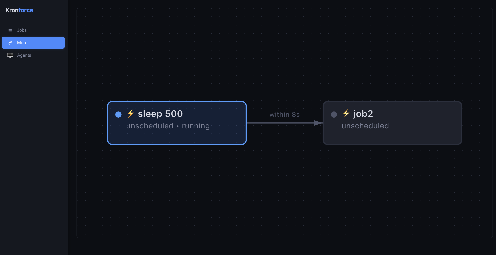
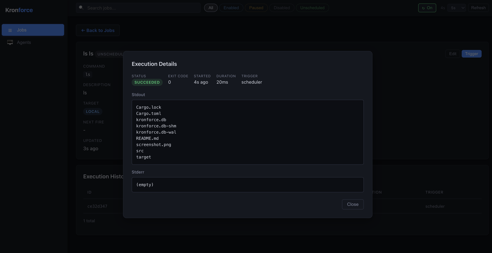
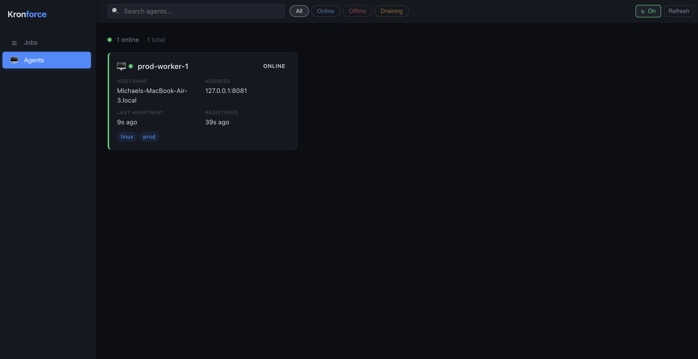
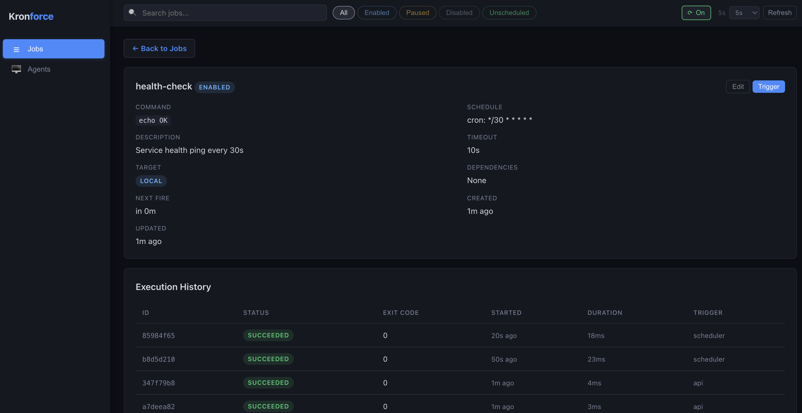
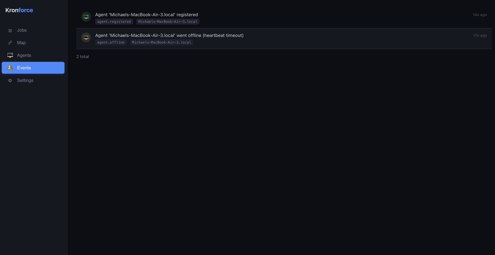

# Kronforce

A workload automation and job scheduling engine built in Rust. Features a controller/agent architecture for distributed job execution.












## Quick Start

### Controller

```bash
cargo run --bin kronforce
```

The controller starts on `0.0.0.0:8080` with a web dashboard, REST API, scheduler, and SQLite database.

### Agent

In another terminal:

```bash
KRONFORCE_CONTROLLER_URL=http://localhost:8080 \
KRONFORCE_AGENT_NAME=agent-1 \
KRONFORCE_AGENT_TAGS=linux,dev \
KRONFORCE_AGENT_ADDRESS=127.0.0.1 \
cargo run --bin kronforce-agent
```

The agent registers with the controller, sends heartbeats, and executes jobs dispatched to it. Jobs with no target still run locally on the controller.

### Configuration

#### Controller

| Variable | Default | Description |
|---|---|---|
| `KRONFORCE_DB` | `kronforce.db` | SQLite database path |
| `KRONFORCE_BIND` | `0.0.0.0:8080` | Listen address |
| `KRONFORCE_TICK_SECS` | `1` | Scheduler tick interval |
| `KRONFORCE_CALLBACK_URL` | `http://{BIND}` | URL agents use to report results back |
| `KRONFORCE_HEARTBEAT_TIMEOUT_SECS` | `30` | Seconds before marking an agent offline |

#### Agent

| Variable | Default | Description |
|---|---|---|
| `KRONFORCE_CONTROLLER_URL` | `http://localhost:8080` | Controller to register with |
| `KRONFORCE_AGENT_NAME` | hostname | Agent display name |
| `KRONFORCE_AGENT_TAGS` | (none) | Comma-separated tags for job targeting |
| `KRONFORCE_AGENT_ADDRESS` | hostname | Address the controller uses to reach this agent |
| `KRONFORCE_AGENT_BIND` | `0.0.0.0:8081` | Agent listen address |
| `KRONFORCE_HEARTBEAT_SECS` | `10` | Heartbeat interval |

## Architecture

```
┌──────────────────────────────────────────────────────────────────┐
│                        CONTROLLER (:8080)                        │
│                                                                  │
│  ┌──────────┐    mpsc     ┌───────────┐            ┌──────────┐ │
│  │  REST    │───────────▶│ Scheduler │───────────▶│ Executor │ │
│  │  API     │            │  (1s tick) │            │          │ │
│  │  + Web   │            └───────────┘            └────┬─────┘ │
│  └──────────┘                                          │       │
│       │                                          ┌─────┴─────┐ │
│       │              ┌─────────┐                 │  Local OR  │ │
│       └─────────────▶│ SQLite  │                 │  Dispatch  │ │
│                      │  (WAL)  │                 └─────┬─────┘ │
│                      └─────────┘                       │       │
└────────────────────────────────────────────────────────┼───────┘
                                                         │
                              HTTP POST /execute         │
                    ┌────────────────────────────────────┘
                    │
                    ▼
┌──────────────────────────────────────────┐
│            AGENT (:8081)                 │
│                                          │
│  ┌──────────┐    ┌───────────────────┐   │
│  │ /execute │───▶│ sh -c "command"   │   │
│  │ /cancel  │    │ stdout/stderr cap │   │
│  │ /health  │    └───────┬───────────┘   │
│  └──────────┘            │               │
│                          │ POST result   │
│                          └──────────────▶│──▶ Controller callback
└──────────────────────────────────────────┘
```

**Flow:**
1. Controller scheduler detects a due job
2. If the job has a target (agent or tag), the executor dispatches it via HTTP to the agent
3. If no target, the executor runs it locally (backward compatible)
4. Agent executes the command, captures stdout/stderr (256KB cap per stream)
5. Agent POSTs the result back to the controller's callback endpoint
6. Controller updates the execution record in SQLite

## API

### Jobs

```bash
# Create a local job (runs on controller)
curl -X POST http://localhost:8080/api/jobs \
  -H 'Content-Type: application/json' \
  -d '{
    "name": "cleanup",
    "command": "echo running cleanup",
    "schedule": {"type": "cron", "value": "0 * * * * *"}
  }'

# Create a job targeting agents with a tag
curl -X POST http://localhost:8080/api/jobs \
  -H 'Content-Type: application/json' \
  -d '{
    "name": "deploy",
    "command": "/opt/scripts/deploy.sh",
    "schedule": {"type": "manual"},
    "timeout_secs": 300,
    "target": {"type": "tagged", "tag": "linux"}
  }'

# Create a job targeting a specific agent
curl -X POST http://localhost:8080/api/jobs \
  -H 'Content-Type: application/json' \
  -d '{
    "name": "db-backup",
    "command": "pg_dump mydb > backup.sql",
    "schedule": {"type": "cron", "value": "0 0 2 * * *"},
    "target": {"type": "agent", "agent_id": "<agent-uuid>"}
  }'

# Create a one-shot job
curl -X POST http://localhost:8080/api/jobs \
  -H 'Content-Type: application/json' \
  -d '{
    "name": "migration",
    "command": "./migrate.sh",
    "schedule": {"type": "one_shot", "value": "2026-04-01T00:00:00Z"}
  }'

# List all jobs (paginated)
curl http://localhost:8080/api/jobs
curl http://localhost:8080/api/jobs?status=active&search=deploy&page=1&per_page=20

# Get / Update / Delete
curl http://localhost:8080/api/jobs/{id}
curl -X PUT http://localhost:8080/api/jobs/{id} -H 'Content-Type: application/json' -d '{"command": "echo updated"}'
curl -X DELETE http://localhost:8080/api/jobs/{id}
```

### Job Targeting

| Target | JSON | Description |
|---|---|---|
| Local | `null` or `{"type": "local"}` | Runs on the controller (default) |
| Specific agent | `{"type": "agent", "agent_id": "uuid"}` | Runs on a specific agent |
| Tagged | `{"type": "tagged", "tag": "linux"}` | Runs on a random online agent with the tag |

### Execution

```bash
# Trigger a job manually
curl -X POST http://localhost:8080/api/jobs/{id}/trigger

# View execution history (paginated)
curl http://localhost:8080/api/jobs/{id}/executions?page=1&per_page=20

# Get execution details (includes stdout/stderr)
curl http://localhost:8080/api/executions/{id}

# Cancel a running execution
curl -X POST http://localhost:8080/api/executions/{id}/cancel
```

### Agents

```bash
# List registered agents
curl http://localhost:8080/api/agents

# Get agent details
curl http://localhost:8080/api/agents/{id}

# Deregister an agent
curl -X DELETE http://localhost:8080/api/agents/{id}

# Health check
curl http://localhost:8080/api/health
```

## Cron Expressions

6-field cron with second-level precision: `sec min hour dom month dow`

| Expression | Description |
|---|---|
| `* * * * * *` | Every second |
| `0 * * * * *` | Every minute |
| `0 0 * * * *` | Every hour |
| `0 0 9 * * *` | Daily at 9:00 AM |
| `0 0 9 * * 1-5` | Weekdays at 9:00 AM |
| `0 */5 * * * *` | Every 5 minutes |
| `*/30 * * * * *` | Every 30 seconds |

Supports: `*`, ranges (`1-5`), lists (`1,3,5`), steps (`*/5`, `1-30/5`).

## Dependencies

Jobs can declare dependencies. A job only runs when all dependencies have a recent successful execution. Circular dependencies are rejected at creation time.

```bash
curl -X POST http://localhost:8080/api/jobs \
  -H 'Content-Type: application/json' \
  -d '{
    "name": "transform",
    "command": "transform.sh",
    "schedule": {"type": "cron", "value": "0 0 3 * * *"},
    "depends_on": ["<extract-job-id>"]
  }'
```

## Job Statuses

| Status | Description |
|---|---|
| `active` | Scheduled and will run |
| `paused` | Won't be scheduled until resumed |
| `disabled` | Permanently disabled |
| `completed` | One-shot job that has fired |

## Execution Statuses

| Status | Description |
|---|---|
| `pending` | Dispatched to agent, waiting to start |
| `running` | Currently executing |
| `succeeded` | Completed with exit code 0 |
| `failed` | Completed with non-zero exit code |
| `timed_out` | Killed after exceeding `timeout_secs` |
| `cancelled` | Cancelled via API |
| `skipped` | Skipped due to failed dependency |

## Output Capture

Stdout and stderr are captured and stored in the database. Each stream is capped at **256KB** — output beyond that is truncated from the front (keeps the tail). Truncated output is prefixed with `[...truncated N bytes...]` and flagged in the API response.

## Development

```bash
# Build both binaries
cargo build

# Run tests
cargo test

# Run controller with debug logging
RUST_LOG=kronforce=debug cargo run --bin kronforce

# Run agent with debug logging
RUST_LOG=kronforce_agent=debug cargo run --bin kronforce-agent
```
