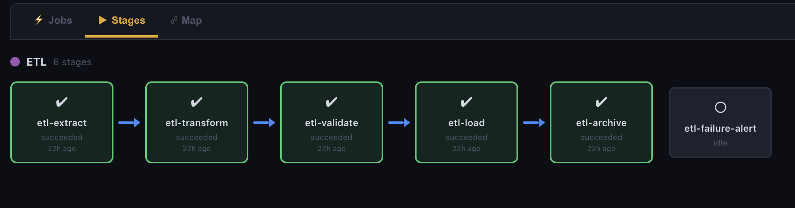

# Migration Guide

Moving your existing scheduled tasks to Kronforce from cron, Jenkins, Rundeck, or Airflow.

## From Cron

### Automatic Import

Kronforce ships with a crontab importer that converts your cron entries directly:

```bash
# Import from the current user's crontab
crontab -l | kronforce-import-crontab kf_your_admin_key

# Import from a file
kronforce-import-crontab kf_your_admin_key < /etc/cron.d/my-jobs

# Import to a specific group
kronforce-import-crontab kf_your_admin_key --group Monitoring

# Import to a remote Kronforce instance
KRONFORCE_URL=http://kronforce:8080 kronforce-import-crontab kf_your_admin_key < mycrontab

# Preview without creating (dry run)
kronforce-import-crontab kf_your_admin_key --dry-run < mycrontab
```

The importer is at `scripts/kronforce-import-crontab` in the Kronforce repo. It:
- Parses standard 5-field cron and converts to 6-field (adds seconds)
- Handles `@daily`, `@hourly`, `@weekly`, `@monthly`, `@yearly` shortcuts
- Skips comments, variable assignments, and `@reboot` entries
- Generates sensible job names from the command path
- Deduplicates names automatically

### Manual Migration

Each cron line maps directly to a Kronforce shell job:

**Cron:**
```
*/5 * * * * /usr/local/bin/check-disk.sh
0 3 * * * /opt/backup/run-backup.sh >> /var/log/backup.log 2>&1
30 */2 * * 1-5 curl -sf https://api.example.com/health
```

**Kronforce equivalent:**

| Cron Expression | Kronforce Cron | Notes |
|---|---|---|
| `*/5 * * * *` | `0 */5 * * * *` | Add leading `0` for seconds field |
| `0 3 * * *` | `0 0 3 * * *` | Kronforce has 6 fields (seconds first) |
| `30 */2 * * 1-5` | `0 30 */2 * * 1-5` | Day-of-week: 0=Sun in both |

**Key differences:**
- Kronforce uses **6-field cron** (seconds, minutes, hours, day-of-month, month, day-of-week)
- Standard cron uses 5 fields (no seconds). Prepend `0` to keep the same schedule.
- Output is captured automatically — no need for `>> logfile 2>&1`
- Environment variables use `{{VAR_NAME}}` syntax instead of shell `$VAR`

### What You Gain

| Cron | Kronforce |
|---|---|
| No dashboard | Visual dashboard with execution history |
| No alerts on failure | Slack, email, PagerDuty notifications |
| No output capture | Full stdout/stderr with search and diff |
| No retry | Automatic retry with exponential backoff |
| No dependencies | Job dependency DAG with time windows |
| Scattered across machines | Centralized with distributed agents |
| No audit trail | Full audit log of all changes |

## From Jenkins

### Automatic Import

Kronforce includes a Jenkins importer that parses Jenkinsfiles and config.xml:

```bash
# Import a Jenkinsfile (declarative pipeline)
kronforce-import-jenkins kf_your_key Jenkinsfile

# Import a Jenkins freestyle job (config.xml)
kronforce-import-jenkins kf_your_key config.xml

# Import as a pipeline (stages become dependent Kronforce jobs)
kronforce-import-jenkins kf_your_key Jenkinsfile --pipeline

# Bulk import from Jenkins export directory
kronforce-import-jenkins kf_your_key ./jenkins-jobs/

# Import to a specific group
kronforce-import-jenkins kf_your_key Jenkinsfile --group CI-CD

# Preview without creating
kronforce-import-jenkins kf_your_key Jenkinsfile --dry-run
```

The importer is at `scripts/kronforce-import-jenkins` in the Kronforce repo. It:
- Parses declarative Jenkinsfile: stages, `sh`/`bat` steps, cron triggers, agent labels, retry, timeout
- Parses Jenkins XML: freestyle builders, pipeline scripts, timer triggers, environment injections
- Bulk imports from `jobs/*/config.xml` directory structure
- Converts Jenkins `H` (hash) cron syntax to standard cron
- `--pipeline` flag wires stages as a Kronforce dependency chain with cascade
- Extracts environment variables and creates them as Kronforce variables

### Exporting from Jenkins

To get your Jenkins configs for import:

```bash
# Single job — copy config.xml from Jenkins home
cp $JENKINS_HOME/jobs/my-pipeline/config.xml .

# Bulk export — copy entire jobs directory
cp -r $JENKINS_HOME/jobs ./jenkins-export

# Or use the Jenkins CLI
java -jar jenkins-cli.jar -s http://jenkins:8080 get-job my-pipeline > config.xml

# Or use the REST API
curl -sf http://jenkins:8080/job/my-pipeline/config.xml > config.xml
```

### Pipeline Migration

Jenkins pipelines map naturally to Kronforce pipeline groups:

**Jenkinsfile:**
```groovy
pipeline {
    agent { label 'linux' }
    triggers { cron('0 6 * * *') }
    stages {
        stage('Build') {
            steps { sh 'make build' }
        }
        stage('Test') {
            steps { sh 'make test' }
        }
        stage('Deploy') {
            steps { sh 'make deploy' }
        }
    }
    post {
        failure { mail to: 'team@example.com' }
    }
}
```

**Kronforce equivalent** (created automatically with `--pipeline`):

1. Job `build` — Shell: `make build`, Cron: `0 0 6 * * *`, Group: Jenkins-Import
2. Job `test` — Shell: `make test`, On Demand, depends on `build`
3. Job `deploy` — Shell: `make deploy`, On Demand, depends on `test`, notifications on failure

Trigger the pipeline: click "Run Pipeline" on the Stages view, or set a pipeline schedule.



### Concept Mapping

| Jenkins | Kronforce | Notes |
|---|---|---|
| Pipeline / Freestyle | Job group + dependency chain | Use `--pipeline` for automatic wiring |
| Stage | Job | One Kronforce job per Jenkins stage |
| `sh` / `bat` step | Shell task | Direct mapping |
| Build trigger (cron) | Cron schedule | 6-field, add seconds |
| `H` in cron | `0` | Jenkins hash randomizer → fixed value |
| Pipeline trigger (SCM) | Webhook trigger | GitHub/GitLab webhook to Kronforce URL |
| Agent label | Agent target tag | `{"type": "tagged", "tag": "linux"}` |
| `retry(N)` | `retry_max` | With configurable backoff |
| `timeout(time: N)` | `timeout_secs` | Convert minutes to seconds |
| `input` step | `approval_required: true` | Manual approval gate |
| Credentials | Secret variables | `{{DB_PASSWORD}}` with `secret: true` |
| Shared libraries | Rhai scripts | Stored in Scripts page |
| Email notification | Job notifications | Slack, email, webhook |
| Parameters | Job parameters | UI form at trigger time |
| Downstream/upstream | `depends_on` | With time window |
| Multibranch | Parameterized + webhook | Pass branch as parameter |

### What You Gain

| Jenkins | Kronforce |
|---|---|
| Java + plugins + database | Single binary, zero dependencies |
| Plugin compatibility issues | Built-in task types |
| Groovy DSL required | Visual UI + REST API |
| Resource-heavy (1GB+ RAM) | Lightweight (~50MB RAM) |
| Complex distributed builds | Simple agent model |
| Plugin-based scheduling | Built-in cron, calendar, interval, pipeline schedules |

### What You Lose

| Jenkins Advantage | Kronforce Alternative |
|---|---|
| Rich plugin ecosystem (1,800+) | 17 built-in task types + custom agents |
| SCM integration (Git polling) | Webhook triggers from CI |
| Build artifacts management | Output extraction + variables |
| Blue Ocean visualization | Pipeline/Stages view with dependency maps |
| Matrix/parallel builds | Fan-out dependencies (multiple jobs depend on one) |

## From Rundeck

Rundeck jobs are typically exported as XML or YAML. There's no automated import tool (Rundeck's format varies significantly by version and plugin set), but the mapping is straightforward.

### Job Mapping

| Rundeck | Kronforce | Notes |
|---|---|---|
| Job name | `name` | Direct mapping |
| Job group | `group` | Kronforce has flat groups (no nesting) |
| Description | `description` | Direct mapping |
| Schedule (cron) | `schedule.type: "cron"` | Add seconds field (prepend `0`) |
| Node filter | `target` | Use tags: `{"type": "tagged", "tag": "linux"}` |
| Script step | `task.type: "shell"` | Paste the command |
| HTTP step | `task.type: "http"` | URL, method, headers, body |
| Script file step | `task.type: "shell"` | Or use Rhai scripting |
| Notification (email) | `notifications.on_failure: true` | Configure SMTP in Settings |
| Notification (webhook) | Webhook channel in Settings | Slack, Teams, PagerDuty |
| Key Storage | Secret variables | `{{DB_PASSWORD}}` with `secret: true` |
| ACL Policies | API key roles + group scoping | 4 roles, per-group access |

### Step-by-Step

1. **Export your Rundeck jobs** — `rd jobs list -p myproject -f yaml > jobs.yaml`
2. **For each job:**
   - Create in Kronforce UI or API
   - Copy the command/script
   - Convert the cron schedule (add seconds field)
   - Set the target (agents replace Rundeck nodes)
   - Configure notifications
3. **Migrate secrets** — recreate as secret variables in Kronforce
4. **Set up agents** — deploy Kronforce agents on the same machines Rundeck was targeting
5. **Test** — trigger each job manually before enabling schedules

### What You Gain

| Rundeck | Kronforce |
|---|---|
| Java + database + web server | Single binary, zero dependencies |
| Plugin ecosystem (complex) | Custom agents in any language (simple) |
| Enterprise license for SSO | OIDC/SSO included free |
| XML/YAML job definitions | JSON API + visual editor |
| Node discovery required | Tag-based agent targeting |

## From Airflow

Airflow DAGs are Python code, so there's no automated converter. However, most Airflow usage falls into patterns that map cleanly to Kronforce.

### Concept Mapping

| Airflow | Kronforce | Notes |
|---|---|---|
| DAG | Job group + dependencies | Kronforce uses flat jobs with dependency chains |
| Task | Job | One Kronforce job per Airflow task |
| BashOperator | Shell task | `{"type": "shell", "command": "..."}` |
| PythonOperator | Shell task or Rhai script | `python3 -c "..."` or custom agent |
| HttpOperator | HTTP task | `{"type": "http", "method": "GET", "url": "..."}` |
| PostgresOperator | SQL task | `{"type": "sql", "driver": "postgres", ...}` |
| EmailOperator | Job notification | `notifications.on_success: true` |
| Sensor | Event-triggered job | Schedule type "event" with pattern matching |
| XCom (cross-task data) | Variables + output extraction | Extract from stdout, pass via `{{VAR}}` |
| Schedule interval | Cron schedule | 6-field cron with visual builder |
| `depends_on_past` | Job dependencies | `depends_on` with time window |
| Pool | Job priority | Higher priority jobs run first |
| Connection | Secret variables | Masked credentials |
| RBAC | API key roles + OIDC | 4 roles with group scoping |

### Migration Pattern

**Airflow DAG:**
```python
with DAG('etl_pipeline', schedule_interval='0 6 * * *'):
    extract = BashOperator(task_id='extract', bash_command='python3 extract.py')
    transform = BashOperator(task_id='transform', bash_command='python3 transform.py')
    load = BashOperator(task_id='load', bash_command='python3 load.py')
    extract >> transform >> load
```

**Kronforce equivalent:**

1. Create group "ETL" with a pipeline schedule: `0 0 6 * * *`
2. Create job `etl-extract`: Shell, `python3 extract.py`, On Demand, Group: ETL
3. Create job `etl-transform`: Shell, `python3 transform.py`, On Demand, depends on `etl-extract`
4. Create job `etl-load`: Shell, `python3 load.py`, On Demand, depends on `etl-transform`

The pipeline schedule triggers `etl-extract` daily at 6am. Dependencies cascade automatically.

### Passing Data Between Jobs (XCom Replacement)

**Airflow:**
```python
def extract(**context):
    count = run_query()
    context['ti'].xcom_push(key='count', value=count)

def transform(**context):
    count = context['ti'].xcom_pull(key='count')
```

**Kronforce:**
1. `etl-extract` outputs: `Extracted 42 records`
2. Add extraction rule: pattern `Extracted (\d+)`, write to variable `RECORD_COUNT`
3. `etl-transform` command: `python3 transform.py --count {{RECORD_COUNT}}`

### What You Gain

| Airflow | Kronforce |
|---|---|
| Python + Postgres + Redis + webserver + scheduler | Single binary |
| DAGs defined in Python code | Visual UI + REST API |
| Requires Python expertise | Any language via custom agents |
| Complex deployment (Kubernetes/Celery) | Download and run |
| Heavyweight for simple jobs | Lightweight for any scale |

### What You Lose

| Airflow Advantage | Kronforce Alternative |
|---|---|
| Rich Python operator ecosystem | 17 built-in task types + custom agents |
| Built-in data lineage | Output extraction + event triggers |
| Kubernetes executor | Agent-based distributed execution |
| Complex DAG branching | Dependencies + event triggers |
| Connection management UI | Secret variables via API/UI |

## Tips for Any Migration

1. **Start small** — migrate a few non-critical jobs first
2. **Run in parallel** — keep old scheduler running while you validate Kronforce
3. **Use the import tools** — `kronforce-import-crontab` and `kronforce-import-jenkins` for automated conversion
4. **Use `--dry-run`** — preview what will be created before committing
5. **Use `--pipeline`** — for Jenkins, this wires stages as dependencies automatically
6. **Set up notifications first** — so you know immediately if a migrated job fails
7. **Use groups** — organize migrated jobs by source system (e.g., "Cron-Import", "Jenkins-Import")
8. **Enable audit log** — track all changes during migration for rollback reference
9. **Use the seed script** — `./data/test/seed.sh` loads example jobs to learn the patterns
